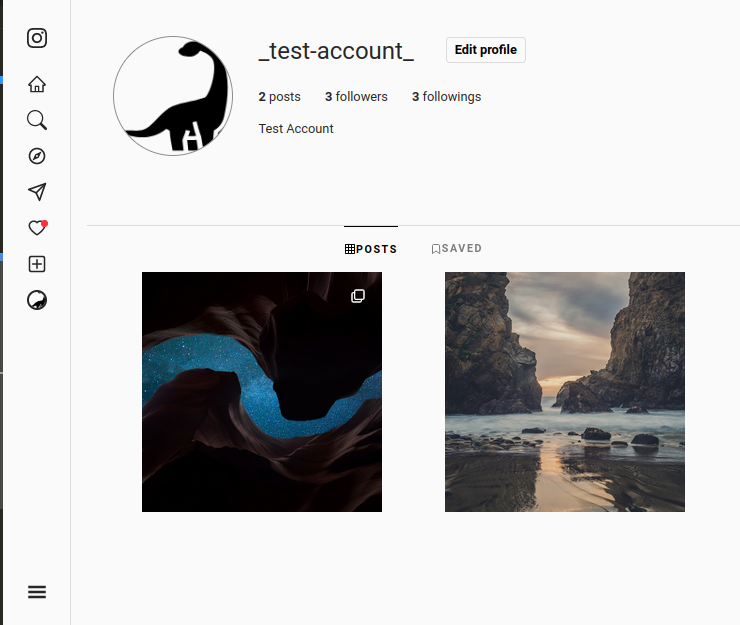

# Instagram Clone

This project is the capstone project for the frontend path of The Odin Project Curriculum.

View the final result with ➡️ [Live Demo](https://instagram-clone-c8823.web.app/).
You can create a profile or look around with a pre made test account.

## Assignment

Replicate your favorite website as close as possible - Pinterest, Facebook, Twitter, etc. Just make sure it has lots of interesting functionality. You’ll be integrating a full array of skills into this one. If you have completed a backend course, you may use that for this project, otherwise use Firebase. This should prove that you now have all the tools and knowledge needed to build a website, just like the ones you use every day.

## Goal of the project

I decided to replicate instagram, because it looked as the biggest challenge to take. My goal was to replicate all the core features involving images. Features with videos are not included because this is a learning project and free Firebase plan has only 5GB storage. All features of marketing or commercial nature are skipped.

### Technologies used to build this project

1. React (functional)
2. Firebase
3. Custom CSS
4. Vanilla JS

## Features

1. Authentication - sign up, login, logout, forgot password.
2. Responsive - app can be used on all screen sizes.
3. Search - search for a user, keep the recent search.
4. Explore - see the latest added posts.
5. Messages - chat with other users or send them posts.
6. Notifications - the user gets notified when someone follows them, likes their post, mentions them in comments or messages them.
7. Create new post - single or multi image. Apply filters or image settings, add post caption and image alts. Disable/enable likes or comments.
8. Profile - keep track of followers/followings, posts and saved posts.
9. User Settings - change/update avatar, name, email, bio or webpage.
10. Suggested users - app will suggest users to follow.
11. Posts - like posts. Comment posts, tag users with @ sign (i.e. @mojo). Reply on comments. Edit or Save posts.
12. Follow users.

## Screenshots

### Main page on large size screen

### Settings page on medium size screen

### Create New Post on small size screen

